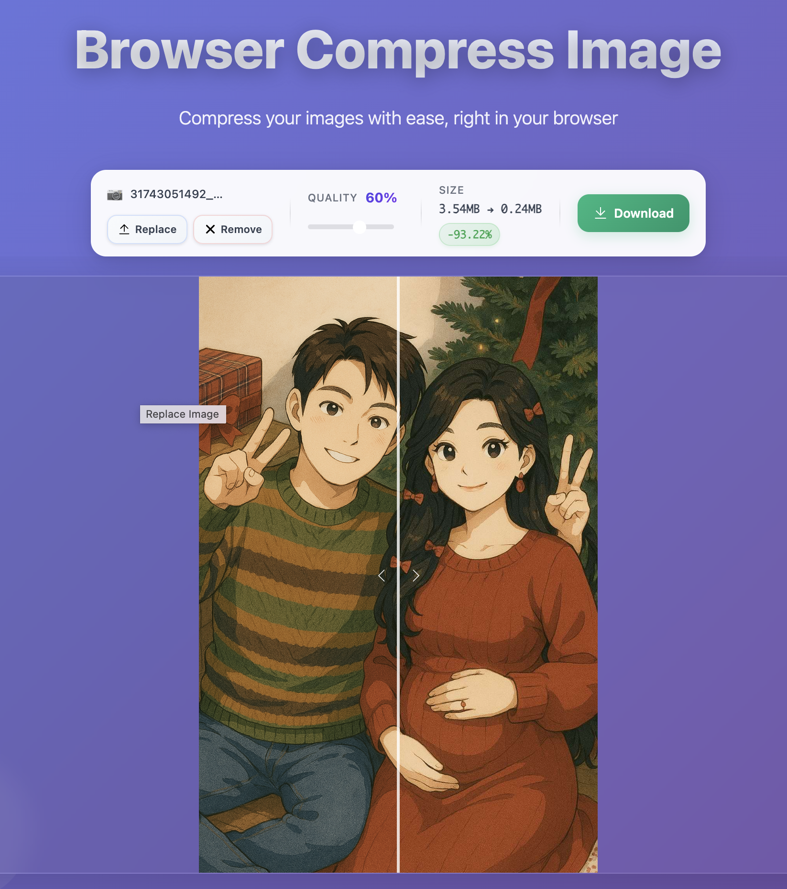

<div align="center">
  
</div>

<span><div align="center">
  
</div></span>

## 感谢
实现依赖于[compressorjs](https://github.com/fengyuanchen/compressorjs)、[browser-image-compression](https://github.com/Donaldcwl/browser-image-compression#readme)、[gifsicle-wasm-browser](https://github.com/renzhezhilu/gifsicle-wasm-browser)

## 安装
```
npm i @simon_he/browse-compress-image
```


## 使用
```
import { compressImage } from '@simon_he/browse-compress-image'
const blob = await compressImage(file, quality)
```

## 压缩对比

